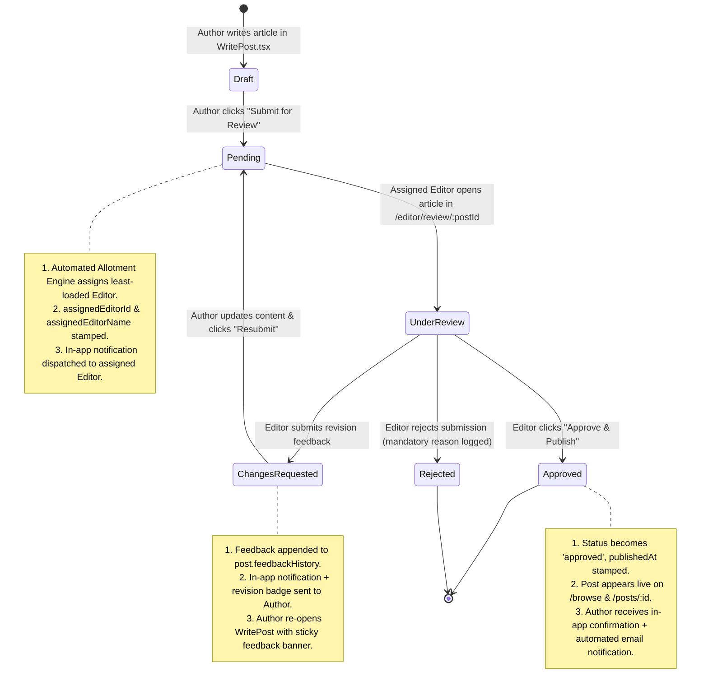

# 📋 Editorial Workflow & Review Pipeline Specification

**Project:** GIKI Chronicles  
**Feature Scope:** Mandatory Review Pipeline, Automated Load-Balanced Allotment, Author Feedback Loop, Dedicated Editor Workspace & Login, In-App + Email Publication Notifications  
**Status:** Approved Architecture & Implementation Blueprint  

---

## 1. Executive Summary & Core Requirements Matrix

| # | Requirement | Core Mechanism | Primary Target Surface |
|---|---|---|---|
| **1** | **Review any submissions before publication** | Strict post state gating (`pending` / `under_review`); database security rules blocking unapproved reads; clean author submit flows. | `src/pages/WritePost.tsx`, `firestore.rules`, `src/pages/BlogBrowse.tsx` |
| **2** | **Send actionable feedback to author** | Persistent audit log (`feedbackHistory` array); structured editor feedback composer; author revision banner and resubmission mode. | `src/pages/EditorReviewDetail.tsx`, `src/pages/WritePost.tsx`, `src/pages/Profile.tsx` |
| **3** | **Automated editor allotment on submission** | Least-busy / load-balanced assignment engine; active editor query; atomic post stamping (`assignedEditorId`). | `src/services/editorialService.ts`, `src/services/firebase.ts` |
| **4** | **Dedicated editor panel for allotted articles** | Personalized "My Queue" vs. full "Team Overview" tabs; live `BlockRenderer` preview; split-pane review actions console. | `src/pages/EditorWorkspace.tsx`, `src/pages/EditorReviewDetail.tsx` |
| **5** | **Author publication confirmation** | Multi-channel confirmation: global in-app notification bell, live toast alert, profile status badges, and automated email dispatch. | `src/components/nav/NotificationBell.tsx`, `src/services/emailService.ts`, `src/pages/Profile.tsx` |
| **6** | **Dedicated editor login portal** | Staff-branded `/editor/login` gateway; strict role validation (`editor`, `moderator`, `admin`); immediate redirect into workspace. | `src/pages/EditorLogin.tsx`, `src/components/CmsRoute.tsx` |

---

## 2. System State Machine & Data Flow



---

## 3. Data Layer & Schema Specifications

### 3.1 Extended Post Interface (`src/services/firebase.ts`)

```typescript
export type PostStatus = 
  | 'draft' 
  | 'pending' 
  | 'under_review' 
  | 'changes_requested' 
  | 'rejected' 
  | 'approved';

export interface PostFeedbackEntry {
  id: string;
  editorId: string;
  editorName: string;
  feedbackText: string;
  createdAt: Timestamp;
  statusSnapshot: 'changes_requested' | 'rejected';
}

export interface Post {
  id?: string;
  title: string;
  content: string; // JSON string representation of Block[]
  description: string;
  photoUrl: string;
  genre: string;
  tags: string[];
  authorId: string;
  authorName: string;
  authorEmail?: string;
  createdAt: Timestamp | null;
  updatedAt?: Timestamp | null;

  // Editorial Workflow Fields
  status: PostStatus;
  assignedEditorId?: string;       // UID of currently assigned editor
  assignedEditorName?: string;     // Display name of assigned editor
  assignedAt?: Timestamp | null;

  reviewedBy?: string;            // UID of finalizing editor
  reviewedByName?: string;
  reviewedAt?: Timestamp | null;
  publishedAt?: Timestamp | null;

  rejectionReason?: string;
  feedbackHistory?: PostFeedbackEntry[]; // Complete audit trail of reviews

  isFeatured: boolean;
}

```

### 3.2 In-App `notifications` Collection Schema

Every operational alert pushes a document to `notifications/{notificationId}`:

```typescript
export type NotificationType = 
  | 'ARTICLE_ALLOTTED'       // Target: Editor (New post assigned to their queue)
  | 'FEEDBACK_RECEIVED'      // Target: Author (Editor requested changes)
  | 'ARTICLE_RESUBMITTED'    // Target: Editor (Author submitted revisions)
  | 'ARTICLE_PUBLISHED'      // Target: Author (Article approved & live)
  | 'ARTICLE_REJECTED';      // Target: Author (Submission rejected)

export interface AppNotification {
  id?: string;
  recipientId: string;       // UID of author or editor receiving the alert
  senderId?: string;         // UID of user triggering the event
  senderName?: string;       // Display name of user triggering the event
  postId: string;
  postTitle: string;
  type: NotificationType;
  message: string;
  isRead: boolean;
  createdAt: Timestamp;
}

```

### 3.3 Automated Email Queue Schema (`mail` Collection)

Utilizes the **Firebase Trigger Email** extension (`firestore-send-email`). When an article is approved, writing a document to `mail/{mailId}` dispatches an automated HTML notification:

```typescript
export interface MailQueueDocument {
  to: string; // Author's email
  message: {
    subject: string;
    text?: string;
    html: string;
  };
  metadata?: {
    postId: string;
    notificationType: string;
  };
}

```

---

## 4. Feature Implementation Details

### 4.1 Automated Load-Balanced Editor Allotment (`src/services/editorialService.ts`)

Instead of a naive circular queue, the engine performs **dynamic workload balancing**:

```typescript
import { db } from './firebase';
import { collection, query, where, getDocs } from 'firebase/firestore';

export async function findLeastLoadedEditor(): Promise<{ uid: string; displayName: string } | null> {
  // 1. Query active, unblocked editors and admins
  const editorsQuery = query(
    collection(db, 'users'),
    where('role', 'in', ['editor', 'admin']),
    where('isBlocked', '!=', true)
  );
  const editorSnap = await getDocs(editorsQuery);
  
  if (editorSnap.empty) return null;
  
  const activeEditors = editorSnap.docs.map(doc => ({
    uid: doc.id,
    displayName: doc.data().displayName || 'Editorial Board'
  }));

  // 2. Query posts currently in pending review states
  const activePostsQuery = query(
    collection(db, 'posts'),
    where('status', 'in', ['pending', 'under_review', 'changes_requested'])
  );
  const postSnap = await getDocs(activePostsQuery);

  // 3. Aggregate active workload counts
  const workloadMap: Record<string, number> = {};
  activeEditors.forEach(e => { workloadMap[e.uid] = 0; });

  postSnap.docs.forEach(doc => {
    const assignedId = doc.data().assignedEditorId;
    if (assignedId && workloadMap[assignedId] !== undefined) {
      workloadMap[assignedId]++;
    }
  });

  // 4. Select the editor with the minimum active assignments
  return activeEditors.reduce((prev, curr) => 
    workloadMap[curr.uid] < workloadMap[prev.uid] ? curr : prev
  );
}

```

#### Assignment Execution on Submission:

When an author clicks **"Submit for Review"**:

1. Post is checked to determine if it is a first-time submission or a revision.
* If **new submission**: `findLeastLoadedEditor()` is invoked.
* If **resubmission (`changes_requested`)**: The post remains assigned to the existing `assignedEditorId`.


2. Post status is set to `'pending'`.
3. An `ARTICLE_ALLOTTED` or `ARTICLE_RESUBMITTED` notification is pushed to the assigned editor.

---

### 4.2 Dedicated Editor Panel Architecture (`src/pages/EditorWorkspace.tsx`)

#### Workspace Layout & Tab Separation

* **Tab 1: "My Queue" (Default Focus)**
* Displays posts where `assignedEditorId == currentUser.uid`.
* Segmented into:
* 🟡 **Awaiting My Review** (`pending` / `under_review`)
* 🟠 **Waiting for Author Revisions** (`changes_requested`)


* **Tab 2: "Team Board" (Visibility & Transparency)**
* Lists all active submissions across all editors.
* Shows assigned editor badges (e.g., `Assigned: Hamza Arif`).
* Provides a **"Pick Up / Reassign to Me"** button so editors can assist teammates when workloads peak.


* **Tab 3: "Published Archive"**
* Articles approved and pushed live by the current editor.


---

### 4.3 Split-Pane Review Workspace (`src/pages/EditorReviewDetail.tsx`)

Clicking **"Open Review"** navigates to `/editor/review/:postId`:

* **Left Pane (70% viewport): Visual Article Inspector**
* Renders the complete article live using `BlockRenderer.tsx`.
* Displays author details, category, tags, read-time calculation, and cover image.


* **Right Pane (30% viewport): Editorial Action Console (Sticky Sidebar)**
* **Audit Log:** Displays full chronological `feedbackHistory` (all previous rounds of notes).
* **Feedback Composer:** Textarea to draft concrete revision points.
* **Actions:**
* 🟢 **Approve & Publish**: Pushes article to `approved`, timestamps `publishedAt`, triggers author in-app notification + email dispatch.
* 🟡 **Request Revisions**: Appends note to `feedbackHistory`, transitions status to `changes_requested`, notifies author.
* 🔴 **Reject**: Sets status to `rejected` with compulsory reason.
* 🔄 **Reassign**: Dropdown allowing admins or editors to reassign the post to another team member.


---

### 4.4 Author Revision Experience (`src/pages/WritePost.tsx`)

1. **Profile Indicator (`Profile.tsx`):**
* Articles marked `changes_requested` display a prominent warning banner with an action button: **"Review Feedback & Edit"**.


2. **Context-Aware Editor:**
* In `WritePost.tsx`, if `status === 'changes_requested'`, a sticky **"Editor Feedback"** callout card appears above the title showing the editor's comments.
* The primary action button switches from "Publish" to **"Resubmit to Editor"**.
* Resubmitting sets status back to `'pending'` and notifies the assigned editor.


---

### 4.5 Author Publication Confirmation & Email Dispatch

When an article is approved:

1. **Real-Time In-App Alert:**
* Notification created in `notifications` collection.
* Global `NotificationBell` updates in real time via Firestore `onSnapshot`.
* If the author is active on the site, a Sonner toast appears:
`toast.success("Your article is now live on GIKI Chronicles!")`


2. **Profile Live Badge:**
* Status badge turns green (`Published`) with a direct clickable link to `/posts/:postId`.


3. **Automated Confirmation Email:**
A document is added to the `mail` collection:
```typescript
await addDoc(collection(db, 'mail'), {
  to: post.authorEmail,
  message: {
    subject: `🎉 Your article "${post.title}" is now live on GIKI Chronicles!`,
    html: `
      <div style="font-family: sans-serif; max-width: 600px; margin: 0 auto; color: #111;">
        <h2 style="color: #059669;">Congratulations, ${post.authorName}!</h2>
        <p>Your article <strong>"${post.title}"</strong> has been reviewed, approved, and officially published on GIKI Chronicles.</p>
        <p>You can read and share your article using the link below:</p>
        <p><a href="[https://gikichronicles.web.app/posts/$](https://gikichronicles.web.app/posts/$){postId}" style="display: inline-block; padding: 10px 20px; background-color: #059669; color: #fff; text-decoration: none; border-radius: 6px; font-weight: bold;">View Your Live Article</a></p>
        <hr style="border: none; border-top: 1px solid #eee; margin: 24px 0;" />
        <p style="font-size: 12px; color: #777;">GIKI Chronicles Editorial Board</p>
      </div>
    `
  }
});

```


---

### 4.6 Dedicated Editor Login Portal (`src/pages/EditorLogin.tsx`)

#### Route: `/editor/login`

* **Visual Theme:** Distinct staff gateway branding (**"GIKI Chronicles Editorial Board"**).
* **Supported Auth Methods:** Email/Password and Google OAuth.
* **Authentication & Guard Logic:**
1. Authenticates user with Firebase Auth.
2. Queries user document in `users` collection.
3. **If role is `editor`, `moderator`, or `admin`:**
* Toast: *"Welcome back, Editor [Name]"*.
* Redirects directly to `/editor`.


4. **If role is standard student user:**
* Blocks workspace entry.
* Displays informative feedback:
* *"Access Restricted: Your account is registered as a Student Author. This portal is reserved for authorized Editorial Board members."*
* Direct button: **"Go to Student Portal / Home"** (`/`).


---

## 5. Security Rules (`firestore.rules`)

```firestore
rules_version = '2';
service cloud.firestore {
  match /databases/{database}/documents {
    
    // Helper function to extract user role
    function getUserRole() {
      return get(/databases/$(database)/documents/users/$(request.auth.uid)).data.role;
    }
    
    function isStaff() {
      return request.auth != null && (getUserRole() in ['admin', 'editor', 'moderator']);
    }

    // Posts Collection Rules
    match /posts/{postId} {
      // Public can only read approved articles
      // Authors can view their own submissions
      // Staff can view all submissions
      allow read: if resource.data.status == 'approved' 
                  || (request.auth != null && (
                      request.auth.uid == resource.data.authorId 
                      || request.auth.uid == resource.data.assignedEditorId 
                      || isStaff()
                  ));

      allow create: if request.auth != null;

      // Update constraints:
      // - Admins have full access
      // - Editors can update review fields, status, and feedback
      // - Authors can only edit content when status is 'draft' or 'changes_requested'
      allow update: if request.auth != null && (
        getUserRole() == 'admin' ||
        isStaff() ||
        (request.auth.uid == resource.data.authorId && resource.data.status in ['draft', 'changes_requested'])
      );
    }

    // Notifications Collection Rules
    match /notifications/{notificationId} {
      allow read: if request.auth != null && resource.data.recipientId == request.auth.uid;
      allow update: if request.auth != null && resource.data.recipientId == request.auth.uid 
                    && request.resource.data.diff(resource.data).affectedKeys().hasOnly(['isRead']);
      allow create: if request.auth != null;
    }

    // Mail Trigger Queue Rules
    match /mail/{mailId} {
      allow create: if isStaff();
      allow read, update, delete: if false; // Cloud extension / worker processes only
    }
  }
}

```

---

## 6. Phased Implementation Roadmap

* **Phase 1: Types & Services**
* Update `Post` & `PostFeedbackEntry` interfaces in `src/services/firebase.ts`
* Create `src/services/editorialService.ts` (`findLeastLoadedEditor`, `submitForReview`, `approvePost`, `requestChanges`)
* Create `src/services/emailService.ts` (`queuePublicationEmail`)


* **Phase 2: Automated Allotment & Author Flow**
* Update `src/pages/WritePost.tsx` with "Submit for Review" & "Resubmit" actions
* Connect auto-assignment engine on submission
* Add revision feedback callout banner in `WritePost.tsx`


* **Phase 3: Dedicated Editor Workspace & Review Screen**
* Implement `src/pages/EditorWorkspace.tsx` ("My Queue" & "Team Board" tabs)
* Implement `src/pages/EditorReviewDetail.tsx` (Split preview + feedback sidebar)
* Wire Approve, Request Changes, Reject, and Reassign actions


* **Phase 4: Notifications & Confirmation Pipeline**
* Build `src/components/nav/NotificationBell.tsx` with Firestore real-time listener
* Update `src/pages/Profile.tsx` submission cards with editorial status badges
* Connect email dispatch trigger in `approvePost()`


* **Phase 5: Staff Entryway & Routing**
* Build `src/pages/EditorLogin.tsx` with role-checking gateway
* Configure `/editor` and `/editor/review/:postId` routes in `src/App.tsx`
* Secure endpoints using `CmsRoute` guard with `allowedRoles={['editor', 'moderator', 'admin']}`


* **Phase 6: Deployment & Validation**
* Deploy updated `firestore.rules`
* Run end-to-end multi-role test (1 Author + 2 Editors + 1 Admin)


